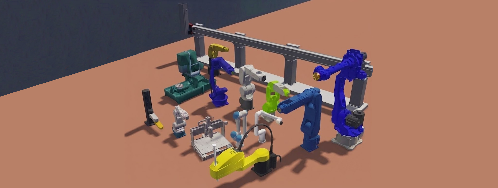

# FreeCAD Webots Exporter Addon

The FreeCAD Webots Exporter is a professional engineering integration tool designed to bridge the gap between computer-aided design (CAD) in FreeCAD 1.0+ and robot simulation in Webots. It automates the transition of native assembly models into fully-articulated, simulation-ready Webots PROTO nodes, preserving complex kinematics, physical properties, and high-fidelity materials.

By automating kinematics extraction, mesh optimization, and communication interface generation, this tool eliminates manual rebuilding of CAD assemblies in simulation editors, reducing model setup times from days to minutes.

## Core Capabilities

- **Assembly-to-PROTO Translation**: Converts hierarchical FreeCAD assemblies and sub-assemblies into native Webots Solid and Joint PROTO structures.
- **Hierarchical Kinematics Introspection**: Automatically constructs Webots joint trees from FreeCAD constraints, resolving complex parent-child links, rotational limits, and anchor points.
- **Sensor and Peripheral Mapping**: Automatically detects and maps peripheral parts prefixed with `camera_`, `lidar_`, `gps_`, or `imu_` into native Webots sensors (`Camera`, `Lidar`, `GPS`, `InertialUnit`), injecting standard parameters (resolution, FOV, range, etc.) directly into the PROTO file.
- **Intelligent Mesh Processing**: Exports visual shapes to OBJ/MTL formats, applies configurable decimation to optimize mesh complexity, and constructs corresponding bounding volumes (primitives or convex hulls) for physical collisions.
- **Multi-Material Fidelity**: Preserves original CAD appearance details, including diffuse colors, transparencies, and texture references directly into Webots appearance definitions.
- **Automated Controller Interfaces**: Generates self-contained python controller stubs for instant connection to standard middleware and automation systems, streaming both joint states and peripheral sensor telemetry.

## Supported Controller Protocols

For downstream control, the exporter generates interface stubs alongside the PROTO definition:

| Protocol | Generated Assets | Dependencies | Description |
|---|---|---|---|
| **TCP Socket** | `<robot>_ctrl.py` | None | Low-latency JSON-based command and telemetry stream over TCP, publishing joint states and serialized peripheral readings (GPS/IMU arrays, high-bandwidth status flags). |
| **ROS 2** | `<robot>_ctrl.py`, `<robot>.urdf` | `rclpy` | Automatically publishes dynamic `robot_description` and `joint_states` telemetry. Subscribes to standard command topics, and publishes active peripheral sensors to native ROS 2 topics (`sensor_msgs/Image`, `sensor_msgs/LaserScan`, `geometry_msgs/PointStamped`, `sensor_msgs/Imu`). |
| **Modbus TCP** | `<robot>_ctrl.py`, `register_map.md` | `pymodbus` | Direct mapping of joint states and peripheral telemetry to Modbus Input Registers (3xxxx) and targets to Holding Registers (4xxxx) for industrial PLC integration. |
| **OPC UA** | `<robot>_ctrl.py`, `mapping.csv` | `asyncua` | Server-client OPC UA variable mapping to monitor/control joints and read peripheral telemetry directly from industrial SCADA systems. |
| **Python GUI** | `<robot>_ctrl.py`, `gui_jogger.py` | None | Lightweight Tkinter dashboard to manually jog joint positions and monitor joint and peripheral telemetry in real-time. |

## Installation

1. Copy or symlink this directory into your FreeCAD Mod directory:
   - Linux: `~/.local/share/FreeCAD/Mod/`
2. Restart FreeCAD.
3. Access the workbench via the Workbench Selector to configure and execute exports.

## License

This software is released under the MIT License. Refer to the LICENSE file for details.
